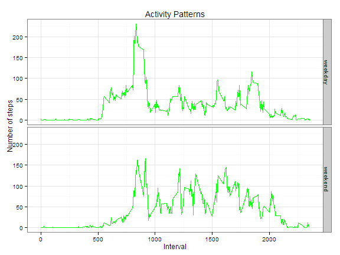

# Reproducible Research: Peer Assessment 1
===========================================


## Loading and preprocessing the data

Download the raw data, read it into memory.

```r
act<-read.csv("activity.csv")
head(act,2)
```

```
##   steps       date interval
## 1    NA 2012-10-01        0
## 2    NA 2012-10-01        5
```

Transform the date into date format

```r
act$date<-as.Date(act$date, format= "%Y-%m-%d")
class(act$date)
```

```
## [1] "Date"
```


## What is mean total number of steps taken per day?

Make a histogram of the total number of steps taken each day


```r
hist(tapply(act[!is.na(act$steps),"steps"],act[!is.na(act$steps),"date"],sum),main="Total Number of Steps Per Day",ylab="Number of Steps",xlab=NA)
```

 

Calculate and report the **mean** and **median** total number of steps taken per day

```r
library("plyr")
dailystat<-tapply(act[!is.na(act$steps),"steps"],act[!is.na(act$steps),"date"],sum)
print(paste("mean value of total number of steps taken per day is", mean(dailystat)))
```

```
## [1] "mean value of total number of steps taken per day is 10766.1886792453"
```

```r
print(paste("median value of total number of steps taken per day is", median(dailystat)))
```

```
## [1] "median value of total number of steps taken per day is 10765"
```


## What is the average daily activity pattern?

```r
library(plyr)
meanInterval<-ddply(act,.(interval),summarize,
               mean=mean(steps,na.rm=TRUE))
maxInterval<-meanInterval[which.max(meanInterval$mean),][1]
print(paste("On average across all the days,the",maxInterval,
            "interval contains the maximum number of steps",sep=" "))
```

```
## [1] "On average across all the days,the 835 interval contains the maximum number of steps"
```

```r
plot(meanInterval$interval,meanInterval$mean,type = "l",
     xlab="interval",ylab="number of steps",main="Average Daily Activity Pattern")
```

 

## Imputing missing values
Calculate and report the total number of missing values in the dataset

```r
nasNum<-sum(is.na(act$steps))
print(paste("The total number of rows with NAs is",nasNum,sep=" "))
```

```
## [1] "The total number of rows with NAs is 2304"
```
Create a new dataset without missing values, replace missing values with mean of the interval

```r
actnona<-act[c("date","interval")]
for(i in 1:nrow(actnona)){
        if(is.na(act$steps[i])){
                actnona$steps[i]<-meanInterval[meanInterval[1]==act[i,"interval"],2]
        }
        else actnona$steps[i]<-act$steps[i]
}
head(actnona,2)
```

```
##         date interval  steps
## 1 2012-10-01        0 1.7170
## 2 2012-10-01        5 0.3396
```
Create a new dataset that is equal to the original dataset but with the missing data filled in.


```r
hist(tapply(actnona[!is.na(actnona$steps),"steps"],actnona[!is.na(actnona$steps),"date"],sum,na.rm=TRUE),main="Total Number of Steps (missing values replaced) Per Day",ylab="Number of Steps",xlab=NA)
```

 
Calculate and report the **mean** and **median** total number of steps (missing values replaced) taken per day

```r
library(plyr)
dailystatna<-tapply(actnona[!is.na(actnona$steps),"steps"],actnona[!is.na(actnona$steps),"date"],sum,na.rm=TRUE)
print(paste("mean value of total number of steps taken per day is", mean(dailystatna)))
```

```
## [1] "mean value of total number of steps taken per day is 10766.1886792453"
```

```r
print(paste("median value of total number of steps taken per day is", median(dailystatna)))
```

```
## [1] "median value of total number of steps taken per day is 10766.1886792453"
```
The shape of the distributione is't change,but the more missing valuse,the more sparse lines.


```r
par(mfcol=c(1,2))
plot(unique(actnona[!is.na(actnona$steps),"date"])
     ,tapply(actnona[!is.na(actnona$steps),"steps"],
             actnona[!is.na(actnona$steps),"date"],sum)
     ,type="h",main="Total Number of Steps(missing values were imputed)",
     xlab=NA,ylab="Number of Steps"
)
plot(unique(act[!is.na(act$steps),"date"])
     ,tapply(act[!is.na(act$steps),"steps"],
             act[!is.na(act$steps),"date"],sum)
     ,type="h",main="Total Number of Steps(include missing data)",
     xlab=NA,ylab=NA
)
```

 


## Are there differences in activity patterns between weekdays and weekends?
Create a new factor variable in the dataset with two levels "weekday" and "weekend"


```r
actnona$weekdays<-ifelse(
        weekdays(actnona$date)=="Saturday"|weekdays(actnona$date)=="Sunday"
        ,"weekend","weekday")
actnona$weekdays<-factor(actnona$weekdays)
```
Make a panel plot of the interval and the average number of steps taken

```r
library(plyr)
actnonaInterval<-ddply(actnona,.(interval,weekdays),summarize,mean=mean(steps))
library("ggplot2")
ggplot(actnonaInterval,aes(x=interval,y=mean))+
        geom_line(colour="green")+
        facet_grid(weekdays~.)+
        labs(title="Activity Patterns",x="Interval",y="Number of steps")+
        theme_bw(base_family = "Times")
```

 
